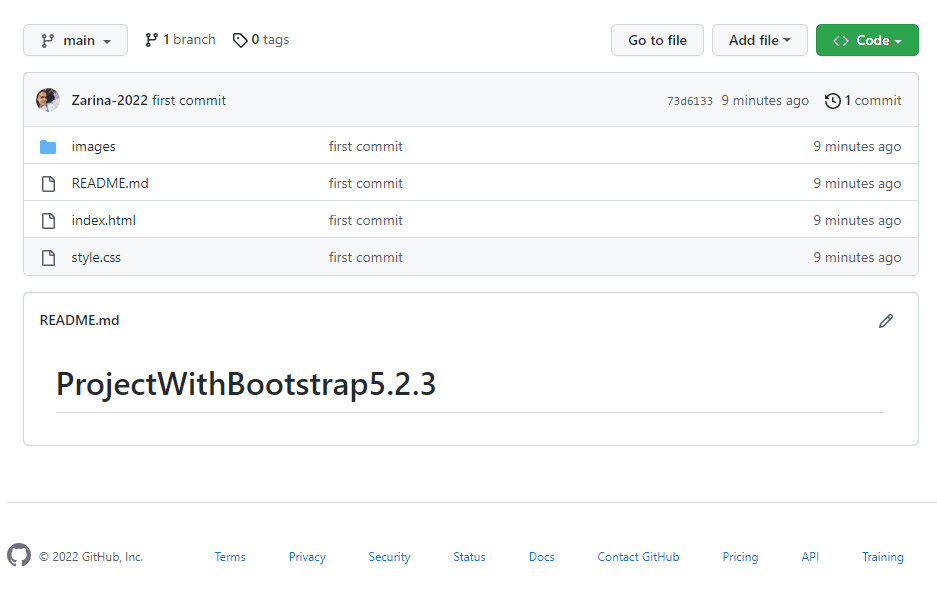

<h1>Webpage designd with Bootstrap</h1>

<h3>This site was made by using only HTML, CSS and <a href="https://www.bootstrapcdn.com/"><b>BOOTSTRAP</b> </a>.</h3>

<h3>Additionally I used <a href="https://cdnjs.com/libraries/font-awesome"><b>Font Awesome</b> </a> (for icons) </h3>

<h3>Preview:</h3>

<h3> I will continue to renew this project as I develop my CSS, HTML and Java Script.  </h3>

<h2> How to install and run the project. </h2>

Do share your valuable opinions, I appreciate your honest  

Enjoy Coding ❤

